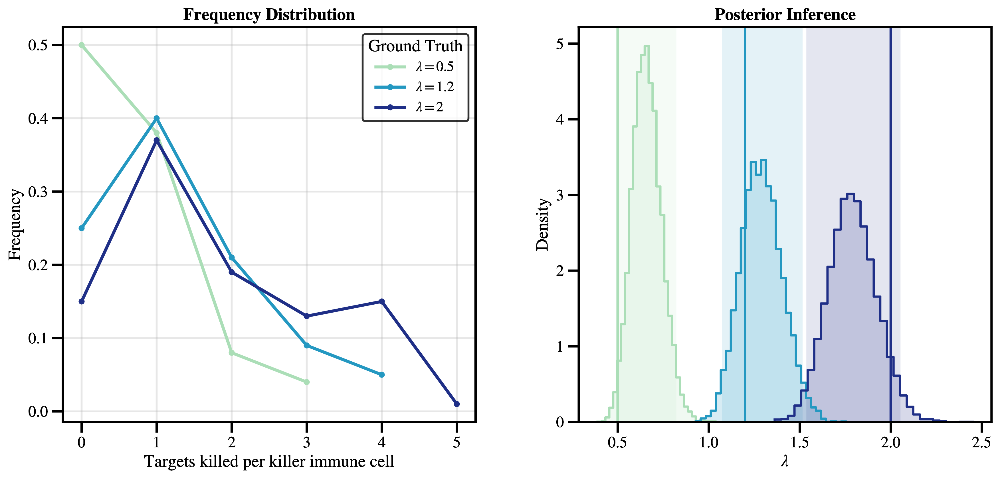
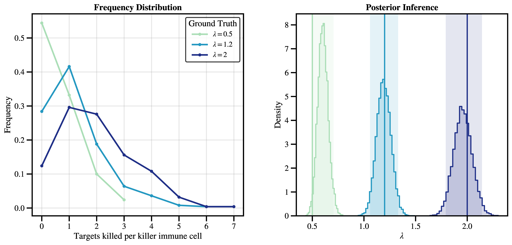
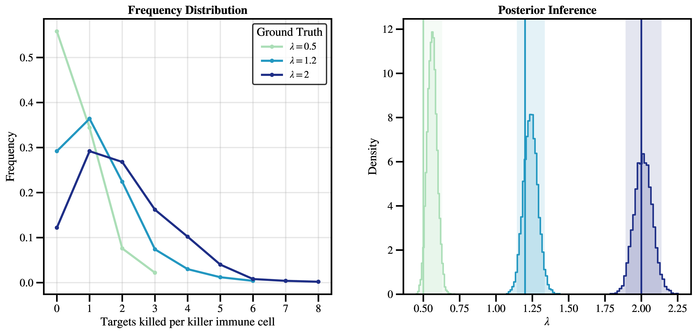
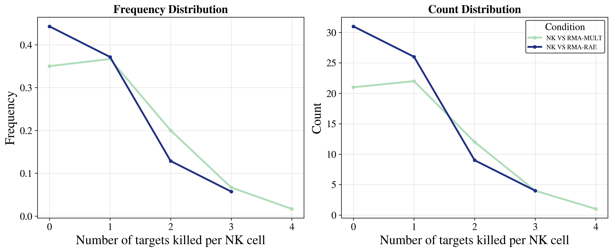
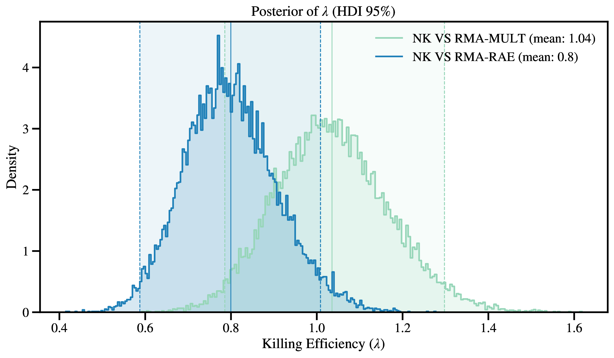
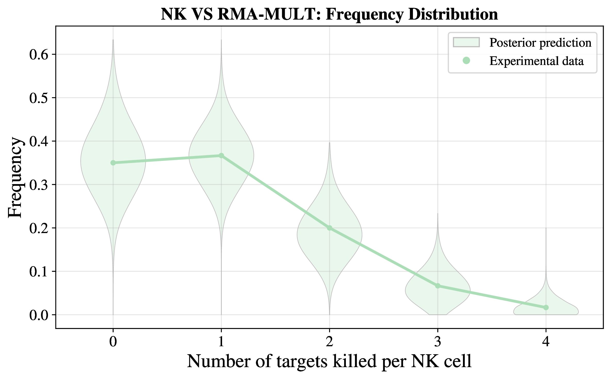
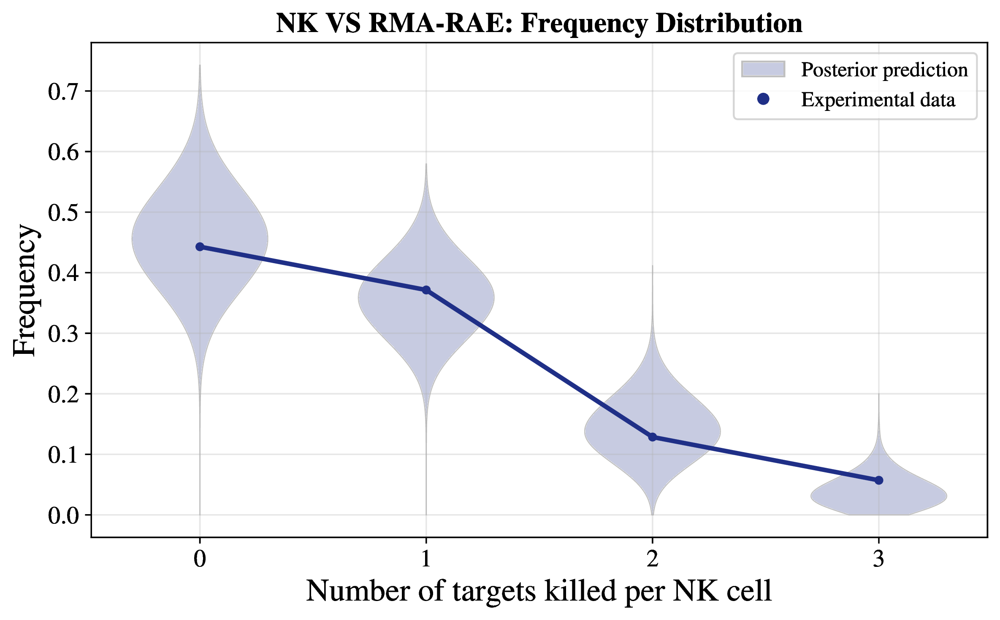

# Sharks

<!-- Test whether the NK cell cytotoxic decision-making is history-dependent or not


   ```math
   \mu_{\lambda} = \frac{\alpha}{\beta}, \sigma_{\lambda} = \frac{\sqrt{\alpha}}{\beta}
   ```

   ```math
   \lambda_i \sim \mathrm{Gamma}(\alpha, \beta)
   ``` -->


---

## 1. one parameter model: Poisson distribution -- $\lambda$
```math
N ={\frac {\lambda ^{k}e^{-\lambda }}{k!}}
```
$N$ is the number of the ***target cells killed per kill cell***.


<br>

---

### **Synthetic Data & Parameter Inference**

- 100 cells.


- 250 cells.


- 500 cells.


- 1000 cells.


### **Inference for experimental data**

1. **NKG2D Data**
   > Only the `NK-WT VS RMA-MULT` and `NK-WT VS RMA-RAE` data can be extracted. For other conditions, further confirmation is required. 

   **Experimental data visualisation**:
   

   **Parameter inference**:
   

   **Posterior prediction**:
   
   

<br>

2. Rtx and bispecific data

   coming
   
   